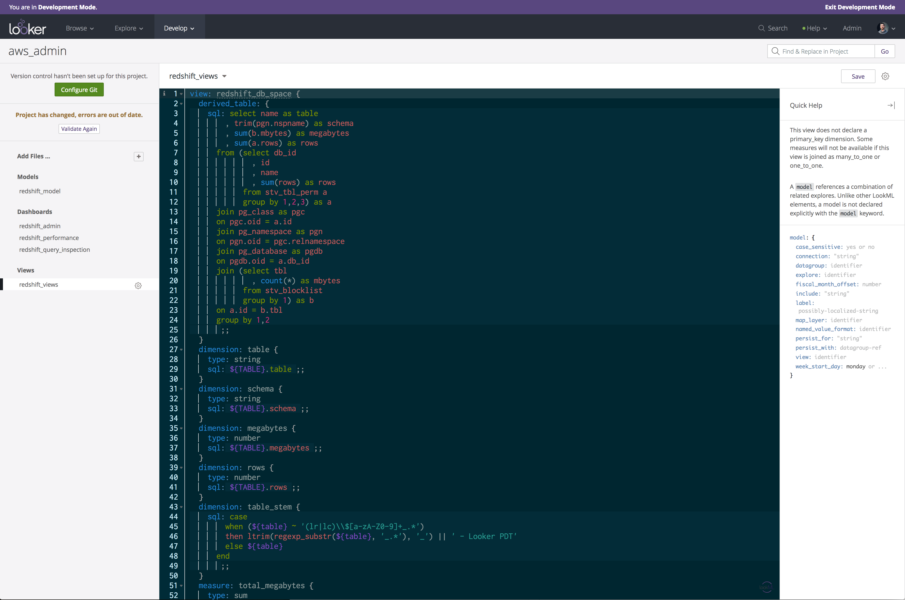

# looker-ide-solarized-dark-theme
Solarized Dark theme for the Looker IDE (to be used with a CSS override add-on like Stylebot).

The LookML Editor is based on the open source [Ace editor](https://ace.c9.io/). While Ace has theme support, the themes does not work as-is in Looker. So I made a quick adaptation of the Solarized Dark theme for it to work using Stylebot.

## Dependencies
- A CSS override add-on, such as [Stylebot](https://chrome.google.com/webstore/detail/stylebot/oiaejidbmkiecgbjeifoejpgmdaleoha?hl=en) for Chrome.
- Either the Inconsolata or the Menlo font installed on your system (or customize the CSS to use your favorite coding font).

## Usage
Copy/paste the styles found in the file looker.css in Stylebot (or alternative add-on) and set the custom stylesheet for your Looker instance URL.

## Known Issues
It's not perfect. There are a few things I don't like but did not have time to investigate further.
If you find this useful, feel free to improve on it and submit pull requests with refined styles and fixes.

Discuss and share updates on the [Looker Discourse post](https://discourse.looker.com/t/customizing-the-ide/7935).

## Change Log
#### 2019-12-20
- Added a class for constants

#### 2018-09-14
- Added a class to reduce the brightness of the indent indicator.

#### 2018-05-24
- Fixed an highlight issue with parentheses in SQL Runner.

#### 2018-05-17
- Original version.
